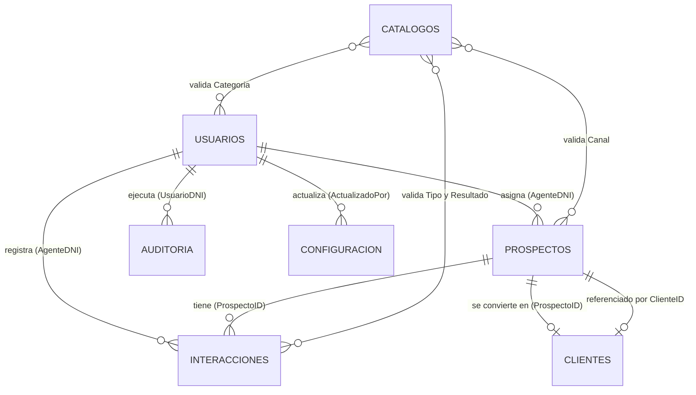

# Estructura de la base de datos

La persistencia de Noely se implementa como una **Google Spreadsheet** administrada por `apps-script/Code.gs`. Cada pestaña equivale a una tabla. No hay claves foráneas nativas: las relaciones se mantienen mediante los identificadores descritos aquí y son validadas por Apps Script.

## Diagrama de relaciones

## Tablas operativas

### `USUARIOS`

Clave primaria lógica: `DNI` (texto; conserva ceros iniciales).

| Columna | Tipo lógico | Descripción |
|---|---|---|
| DNI | texto, PK | Identificador único de la cuenta. |
| Apellidos, Nombres | texto | Identidad visible de la persona. |
| Estado | texto | Estado de la cuenta, p. ej. `ACTIVO` o cesado. |
| TipoUsuario | texto | Rol; determina si la cuenta es administradora o agente. |
| FechaRegistro, UltimoAcceso | fecha/hora | Auditoría de alta y último acceso. |
| Dispositivo | texto | Dispositivo informado en el acceso. |
| Correo, Celular | texto | Canales opcionales para entregar credenciales. |
| Categoria | texto, FK lógica | Etiqueta activa de `CATALOGOS` tipo `CATEGORIA_AGENTE`. |
| Pass | texto | Hash de la contraseña; nunca debe exponerse por la API. |

### `PROSPECTOS`

Clave primaria lógica: `ID` (generado con prefijo `PRO`).

| Columna | Tipo lógico | Relación / descripción |
|---|---|---|
| ID | texto, PK | Identificador del prospecto. |
| Nombre, Documento, Telefono, Correo | texto | Datos de contacto. `Documento` se valida contra duplicados al convertir a cliente. |
| Canal | texto, FK lógica | Etiqueta activa de `CATALOGOS.CANAL`. |
| AgenteDNI | texto, FK → `USUARIOS.DNI` | Agente responsable; debe ser una cuenta activa. |
| FechaCreacion, FechaActualizacion | fecha/hora | Trazabilidad de alta y edición. |
| Observaciones | texto | Información inicial de la oportunidad. |
| FechaNacimiento | fecha | Dato completado durante la captación. |
| Profesion, Distrito, Direccion, Notas | texto | Información complementaria de captación. |
| ClienteID | texto, FK → `CLIENTES.ID`, opcional | Cliente resultante de la conversión. Vacío mientras no exista conversión. |
| Captado | texto | Indicador `SI` / `NO`; conserva compatibilidad con registros históricos. |
| JSON | JSON serializado | Campos personalizados del prospecto. |

### `INTERACCIONES`

Clave primaria lógica: `ID` (generado con prefijo `INT`). Representa el historial comercial y las próximas citas.

| Columna | Tipo lógico | Relación / descripción |
|---|---|---|
| ID | texto, PK | Identificador de la interacción. |
| ProspectoID | texto, FK → `PROSPECTOS.ID` | Prospecto atendido. Un prospecto puede tener muchas interacciones. |
| AgenteDNI | texto, FK → `USUARIOS.DNI` | Agente que registró el contacto. |
| FechaHoraContacto | fecha/hora | Fecha efectiva del contacto. |
| FechaHora | fecha/hora | Fecha de registro de la interacción. |
| Tipo | texto, FK lógica | Etiqueta de `CATALOGOS.REUNION` o tipo manual permitido. |
| Resultado | texto, FK lógica | Etiqueta de `CATALOGOS.RESULTADO` o `CAPTADO_RESULTADO`, según la etapa. |
| Comentario | texto | Nota de la interacción. |
| ProximoContacto | fecha/hora, opcional | Fecha para agenda/seguimiento. |
| Captacion | texto | Indicador de captación. |
| EstadoCaptacion | texto | Estado asociado a la captación. |
| Etapa | texto | Etapa comercial: `PROSPECTO`, `NEGOCIACION` o `NO CONTINUA`. `CLIENTE` se deriva de la conversión. |

### `CLIENTES`

Clave primaria lógica: `ID` (generado con prefijo `CLI`). Es la entidad creada al convertir un prospecto.

| Columna | Tipo lógico | Relación / descripción |
|---|---|---|
| ID | texto, PK | Identificador del cliente. |
| ProspectoID | texto, FK → `PROSPECTOS.ID` | Prospecto de origen. Es único lógicamente: un prospecto genera como máximo un cliente. |
| Nombre, Documento, Telefono, Correo | texto | Copia de datos básicos del prospecto para consulta. |
| FechaCierre | fecha/hora | Momento de creación/conversión del cliente. |
| Estado | texto | Estado de la cartera; al crear se usa `ACTIVO`. |
| AgenteDNI | texto, FK → `USUARIOS.DNI` | Agente responsable. |
| EstadoCaptacion | texto | Estado de captación final. |
| CierreVenta | fecha, opcional | Fecha efectiva de cierre de la venta. |

Los campos de perfil ampliado (nacimiento, profesión, distrito, dirección y notas) tienen como fuente principal `PROSPECTOS`, aunque el módulo Clientes los muestre.

## Tablas de soporte

### `CATALOGOS`

Clave lógica compuesta: `Tipo` + `Etiqueta`.

| Columna | Tipo lógico | Descripción |
|---|---|---|
| Tipo | texto | Dominio del catálogo. Valores admitidos: `CANAL`, `ESTADO`, `RESULTADO`, `CAPTADO_RESULTADO`, `REUNION`, `CATEGORIA_AGENTE`. |
| Etiqueta | texto | Valor visible y también el valor guardado en las tablas consumidoras. |
| Orden | número | Orden de presentación. |
| Activo | texto/booleano | Si vale `NO`, la opción deja de estar disponible para nuevas selecciones. |

No usa IDs. Al renombrar una etiqueta desde la aplicación se actualizan los valores históricos vinculados: `Canal` en prospectos, `Tipo`/`Resultado` en interacciones y `Categoria` en usuarios. `ESTADO` no tiene una relación de cascada definida en el código actual.

### `CONFIGURACION`

Clave primaria lógica: `Clave`.

| Columna | Tipo lógico | Descripción |
|---|---|---|
| Clave | texto, PK | Nombre del ajuste global. |
| Valor | texto | Valor configurado. |
| Tipo | texto | Tipo de interfaz/validación: texto, URL, color, booleano o selección. |
| Descripcion | texto | Explicación del ajuste. |
| Actualizado | fecha/hora | Última modificación. |
| ActualizadoPor | texto, FK lógica → `USUARIOS.DNI` | Administrador que actualizó el valor. |

### `AUDITORIA`

No tiene clave primaria propia; cada fila es un evento de trazabilidad.

| Columna | Tipo lógico | Relación / descripción |
|---|---|---|
| UsuarioDNI | texto, FK → `USUARIOS.DNI` | Actor que realizó la operación. |
| Accion | texto | Acción ejecutada, como crear, editar, registrar, captar, convertir o reasignar. |
| Entidad | texto | Tipo de entidad afectada. |
| EntidadID | texto | ID de la entidad afectada; su tabla depende de `Entidad`. |
| FechaHora | fecha/hora | Momento del evento. |
| Descripcion | texto | Detalle legible del cambio. |

### `LOG_ACTUALIZACIONES`

Registro técnico de ejecuciones de mantenimiento del Apps Script.

| Columna | Tipo lógico | Descripción |
|---|---|---|
| Fecha | fecha/hora | Momento de ejecución. |
| Función | texto | Función o proceso ejecutado. |
| Resultado | texto | Resultado informado. |
| Detalle | texto | Resumen técnico de la operación. |

## Reglas de integridad y flujo principal

1. Un usuario activo administra muchos prospectos e interacciones mediante su `DNI`.
2. Un prospecto puede tener cero o muchas interacciones; cada interacción pertenece a un único prospecto.
3. Al convertir, se crea o actualiza un único cliente por `ProspectoID`, se escribe `PROSPECTOS.ClienteID` y el prospecto queda marcado como captado.
4. No se permite convertir si ya existe otro cliente con el mismo `Documento` asociado a otro prospecto.
5. Las operaciones CRM verifican la sesión y los permisos contra `USUARIOS`; los agentes solo acceden a sus propios prospectos y clientes, mientras que los administradores acceden al conjunto.
6. Las fechas se guardan como valores `Date` de Google Sheets, con formato visible `DD/MM/AAAA` (y `HH:mm` cuando corresponde); la API las entrega en ISO 8601.

## Fuente de verdad

El esquema está definido en [`apps-script/Code.gs`](apps-script/Code.gs), en las constantes `USERS_HEADERS`, `SETTINGS_HEADERS`, `UPDATE_LOG_HEADERS` y `CRM_SHEETS`. El frontend conserva cachés locales para funcionar ante fallos de red, pero la hoja de cálculo es la fuente de verdad.
